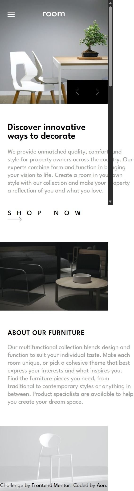
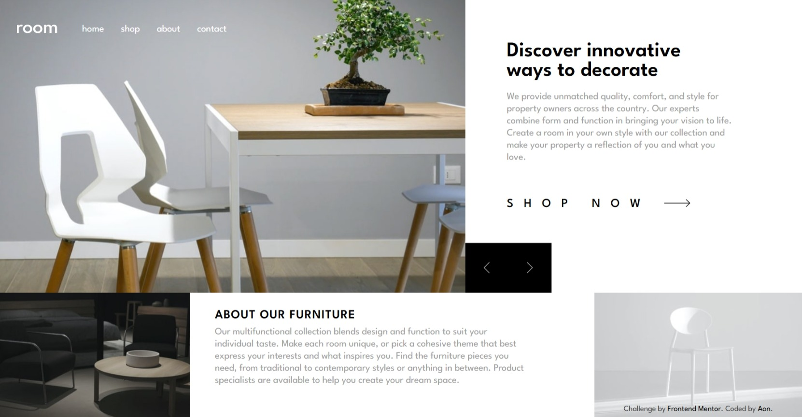
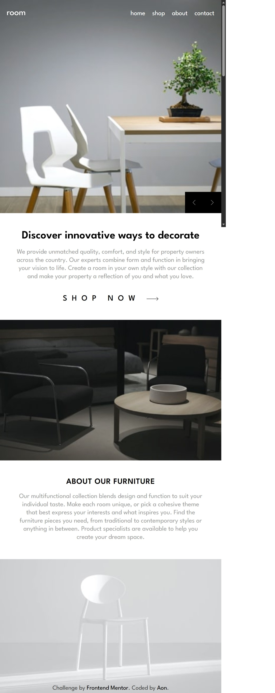

# Frontend Mentor - Room homepage solution

This is a solution to the [Room homepage challenge on Frontend Mentor](https://www.frontendmentor.io/challenges/room-homepage-BtdBY_ENq). Frontend Mentor challenges help you improve your coding skills by building realistic projects.

## Table of contents

- [Frontend Mentor - Room homepage solution](#frontend-mentor---room-homepage-solution)
  - [Table of contents](#table-of-contents)
  - [Overview](#overview)
    - [The challenge](#the-challenge)
    - [Screenshot](#screenshot)
    - [Links](#links)
  - [Author](#author)

**Note: Delete this note and update the table of contents based on what sections you keep.**

## Overview

### The challenge

Users should be able to:

- View the optimal layout for the site depending on their device's screen size
- See hover states for all interactive elements on the page
- Navigate the slider using either their mouse/trackpad or keyboard

### Screenshot

  <figure style="margin: 0; height: 100%; text-align: center;">
    <figcaption>Mobile preview</figcaption>
    

  </figure>
  

  <figure style="margin: 0; height: 50%; text-align: center;">
    <figcaption>Tablet preview</figcaption>
    
  </figure>
  <figure style="margin: 0; height: 50%; text-align: center;">
    <figcaption>Desktop preview</figcaption>
    
  </figure>
  

### Links

- [Solution URL](To be added)
- [Live Server URL](To be added)

## Author

- Frontend Mentor - [@Aon](https://www.frontendmentor.io/profile/Aon-m)
- CSSBattle - [@Aon](https://cssbattle.dev/player/aon)
- Github - [@Aon-m](https://github.com/Aon-m)
